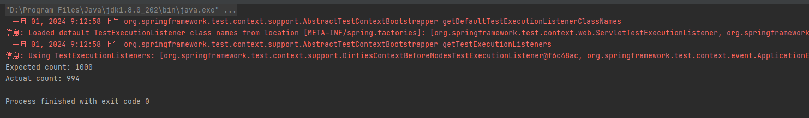

# 目的

2024年7月到2024年10月底，这段时期和诸多大厂进行面试，发现有两个大厂面试官问到spring中的单例对象是否是线程安全的，我都回答：“这些类如果没有设计者采用一系列设计如同步原语的情况下，这些类都是线程不安全的。除非设计时这些类都是无状态的服务”。非常感谢最后一位面试官愿意和我争论这个问题，不然我一直也为什么之前的面试挂掉。

但是我依旧坚持我的观点，这个项目就是为了验证我的观点而创建的！

下面的小结我将会说明我的设计思路，并附上我的效果截图。以及结论总结。欢迎提pr各位大佬来打脸。

# 设计思路

设计一个非线程安全的对象放入spring 容器，然后从容器中取出该对象。将其置入多线程环境下，调用其暴露的方法看看是否一致。

具体来说,我声明com.piliepeng.service.CounterService这个类。有一个int 型的初始化为0的成员变量，然后我使用1000个线程对其做累加操作。查看最后的结果是否等于1000

测试代码见com.piliepeng.service.CounterServiceTest，直接使用IDEA运行testConcurrentIncrement这个方法即可。

# 效果截图

# 结论总结

spring框架没办法保证其实现的单例对象是线程安全的。线程安全需要由类的定义者也就是框架使用者保证。

spring框架仅仅保证了在生成和获取bean对象的使用采用了同步机制来确保这个过程的线程安全性，主要体现两个方面： 1.如果缓存中有的话将会从缓存中取，三级缓存都使用

2.如果缓存中没有，从FactoryBean中拿的时候使用了Synchronize来同步，具体可见org.springframework.beans.factory.support.FactoryBeanRegistrySupport.getObjectFromFactoryBean方法。然后将获取的bean放入缓存中

但是归根到底也是Spring框架容器类org.springframework.beans.factory.support.AbstractBeanFactory.getObjectForBeanInstance的线程安全性。而容器类所持有的单例对象没有线程安全性

